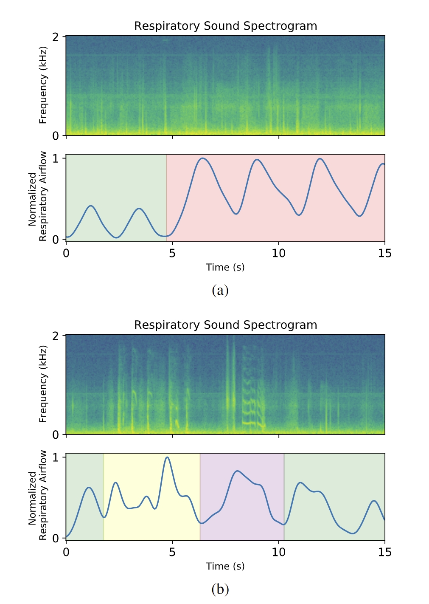

# Ensemble Deep Learning Model for Dimensionless Respiratory Airflow Estimation Using Respiratory Sound

This repository contains the models developed in the article "Ensemble Deep Learning Model for Dimensionless Respiratory Airflow Estimation Using Respiratory Sound". The code can be used to run the trained models (with the different sets of files considered).

In our study, we proposed a novel calculation of dimensionless respiratory airflow curves from respiratory sound recordings. As the name suggests, the dimensionless respiratory airflow is a measure similar to regular airflow; however, it does not provide any information regarding the absolute volume of air being inhaled or exhaled at any given time. Therefore, the dimensionless airflow curve allows the assessment of a subject inspiration and expiration patterns with relative flow rates. In our study, the dimensionless respiratory airflow was obtained from the global Electrical Impedance Tomography waveform. For more details please refer to the associated article.

Below, are present the two types of acquisitions considered in this study

(a) TbDb acquisition: tidal breathing followed by deep breathing (green - tidal breathing; red - deep breathing); (b) TbCS acquisition: tidal breathing followed by forced cough and speech (green - tidal breathing; yellow - cough; purple - speech)

## Requirments
- Python 3.9.15
- Tensorflow 2.9.0
- Librosa 0.9.2
- Scipy
- Numpy
- Pandas
- Scikit-learn
- Itertools
- Matplotlib

## Associated articles
In the case you use our models, cite the following manuscript:

Pessoa, D., Rocha, B. M., Gomes, M., Rodrigues, G., Petmezas, G., Cheimariotis, G.-A., Maglaveras, N., Marques, A., Frerichs, I., de Carvalho, P., & Paiva, R. P. (2024). Ensemble deep learning model for dimensionless respiratory airflow estimation using respiratory sound. In Biomedical Signal Processing and Control (Vol. 87, p. 105451). Elsevier BV. https://doi.org/10.1016/j.bspc.2023.105451

The data used in this work can be found at:

Pessoa, D., Rocha, B. M., Strodthoff, C., Gomes, M., Rodrigues, G., Petmezas, G., Cheimariotis, G.-A., Kilintzis, V., Kaimakamis, E., Maglaveras, N., Marques, A., Frerichs, I., Carvalho, P. de, & Paiva, R. P. (2023). BRACETS: Bimodal repository of auscultation coupled with electrical impedance thoracic signals. In Computer Methods and Programs in Biomedicine (Vol. 240, p. 107720). Elsevier BV. https://doi.org/10.1016/j.cmpb.2023.107720
